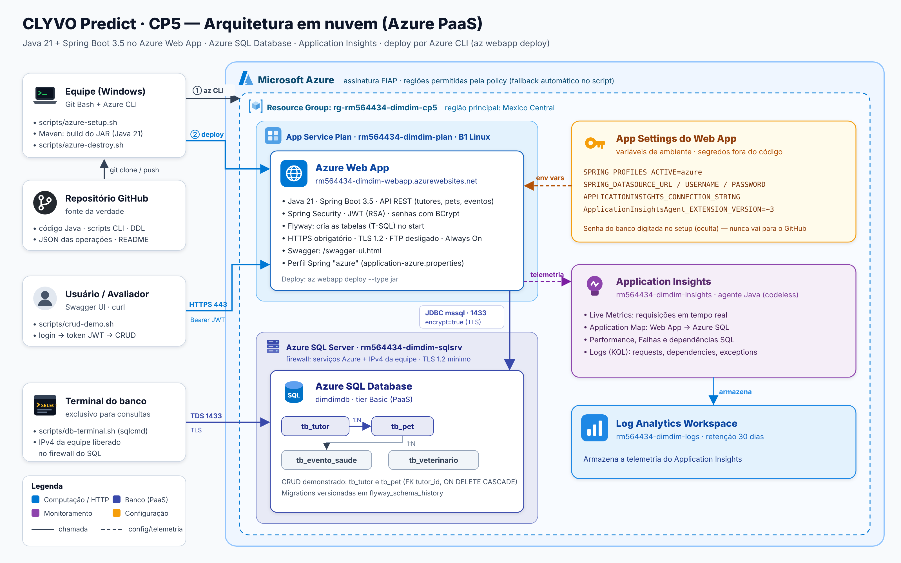

# CLYVO Predict · CP5 — Aplicativo e Banco em Nuvem (Azure)

**Disciplina:** DevOps Tools & Cloud Computing · FIAP 2026 · Prof. João Menk
**Checkpoint:** 2º Checkpoint do 2º semestre (CP5) — Web App + Banco de Dados PaaS

| Integrante | RM |
|---|---|
| Camily | RM566520 |
| Eduarda (representante) | RM564434 |
| Lucas | RM566503 |

**Vídeo da solução funcionando:** [YouTube — CLYVO Predict CP5](https://www.youtube.com/watch?v=INSERIR_LINK)

---

## 1. Descrição da solução

O **CLYVO Predict** é a API backend da nossa solução para o Challenge FIAP 2026 com a healthtech veterinária **Clyvo**. O problema do mercado pet é a jornada de cuidado fragmentada: o tutor só procura a clínica em emergências, o histórico do animal se perde e a clínica perde recorrência. A API centraliza **tutores**, **pets** e **eventos de saúde**, e mantém para cada pet um **Health Score** de 0 a 100 (a "barra de vida") que sobe com cuidados preventivos (vacina, consulta, exame) e cai com doenças e acidentes.

Neste checkpoint, o código Java da **Sprint 4** foi publicado no **Azure Web App** usando **Azure SQL Database** (PaaS) e monitorado pelo **Application Insights**. Toda a infraestrutura é criada por script **Azure CLI** e o deploy é feito com `az webapp deploy`.

**Benefícios para o negócio**

- **Continuidade do cuidado:** histórico do pet persistido em banco gerenciado, disponível para tutor e clínica a qualquer momento.
- **Operação sem servidor para administrar:** Web App e Azure SQL são PaaS — patches, backups e alta disponibilidade ficam com o Azure.
- **Visibilidade:** Application Insights mostra tempo de resposta, falhas e chamadas ao banco em tempo real, o que permite agir antes de o usuário reclamar.
- **Segurança e LGPD:** senhas com BCrypt, autenticação JWT, tráfego só por HTTPS/TLS 1.2 e nenhum segredo no código-fonte.
- **Ambiente reproduzível:** um script cria tudo do zero em poucos minutos e outro remove tudo, evitando custo parado.

## 2. Arquitetura



| Recurso Azure | Nome | Função |
|---|---|---|
| Resource Group | `rg-rm564434-dimdim-cp5` | Agrupa todos os recursos do CP5 |
| App Service Plan | `rm564434-dimdim-plan` (B1, Linux) | Capacidade de computação do Web App |
| Web App | `rm564434-dimdim-webapp` (Java 21) | Hospeda a API Spring Boot |
| Azure SQL Server | `rm564434-dimdim-sqlsrv` | Servidor lógico, firewall e TLS 1.2 |
| Azure SQL Database | `dimdimdb` (Basic) | Banco relacional PaaS |
| Log Analytics Workspace | `rm564434-dimdim-logs` | Armazena a telemetria |
| Application Insights | `rm564434-dimdim-insights` | Monitoramento da aplicação e do banco |

**Fluxo:** a equipe executa `scripts/azure-setup.sh` (Azure CLI), que cria os recursos, grava as configurações sensíveis como **App Settings** (variáveis de ambiente), compila o JAR e faz o deploy. O usuário acessa a API por HTTPS; a API autentica com JWT e grava no Azure SQL via JDBC criptografado. O agente Java do Application Insights coleta requisições, dependências SQL e exceções sem alterar o código.

**Região:** a assinatura FIAP só permite algumas regiões (policy *Allowed resource deployment regions*) e, em alguns momentos, uma região recusa novos servidores SQL. O script tenta `mexicocentral`, `eastus2`, `eastus`, `southcentralus` e `southafricanorth`, nessa ordem, e usa a primeira que aceitar.

## 3. Segurança (melhorias em relação ao CP4)

| Ponto | Como foi resolvido |
|---|---|
| Credenciais do banco | Nunca ficam no repositório. A senha é digitada no `azure-setup.sh` (entrada oculta) e enviada direto para as **App Settings** do Web App. O código lê `SPRING_DATASOURCE_URL`, `SPRING_DATASOURCE_USERNAME` e `SPRING_DATASOURCE_PASSWORD`. |
| Credenciais do Oracle (Sprint 4) | Removidas do `application.properties`; agora vêm de `ORACLE_URL`, `ORACLE_USER` e `ORACLE_PASSWORD`. |
| Chave privada do JWT | Gerada localmente pelo script, ignorada pelo `.gitignore` e empacotada apenas no JAR enviado ao Azure. |
| Transporte | HTTPS obrigatório no Web App, TLS 1.2 mínimo no Web App e no SQL, JDBC com `encrypt=true`. |
| Banco | Firewall libera só serviços do Azure e o IPv4 da equipe. Senhas dos tutores gravadas com hash BCrypt. |

## 4. Banco de dados

O Flyway cria as tabelas automaticamente quando a aplicação sobe no Azure, a partir de `src/main/resources/db/migration/sqlserver/V1__cria_tabelas.sql`. A mesma DDL está em **[`scripts/ddl-azure-sql.sql`](scripts/ddl-azure-sql.sql)**.

| Tabela | Descrição | Relacionamento |
|---|---|---|
| `tb_tutor` | Tutores (nome, e-mail único, telefone, perfil, senha BCrypt) | 1:N com `tb_pet` |
| `tb_pet` | Pets (espécie, raça, idade, peso, health score) | FK `tutor_id` → `tb_tutor` (ON DELETE CASCADE) |
| `tb_evento_saude` | Vacinas, consultas, doenças etc. | FK `pet_id` → `tb_pet` |
| `tb_veterinario` | Veterinários (CRMV único) | — |

O CRUD do vídeo é demonstrado nas tabelas **`tb_tutor`** e **`tb_pet`**, que têm relacionamento por chave estrangeira.

## 5. Rotas da API

Base: `https://rm564434-dimdim-webapp.azurewebsites.net` · Swagger: `/swagger-ui.html`

| Método | Rota | Autenticação | Descrição |
|---|---|---|---|
| POST | `/api/tutores` | pública | Cadastra tutor |
| POST | `/api/tutores/login` | pública | Login, devolve o token JWT |
| GET | `/api/tutores/{id}` | JWT (o próprio tutor) | Consulta tutor |
| PUT | `/api/tutores/{id}` | JWT (o próprio tutor) | Atualiza tutor |
| DELETE | `/api/tutores/{id}` | JWT (o próprio tutor) | Exclui tutor |
| POST | `/api/pets` | JWT | Cadastra pet do tutor logado |
| GET | `/api/pets` | JWT | Lista os pets do tutor logado (paginado) |
| GET | `/api/pets/{id}` | JWT (dono) | Consulta pet |
| PUT | `/api/pets/{id}` | JWT (dono) | Atualiza pet |
| DELETE | `/api/pets/{id}` | JWT (dono) | Exclui pet |

As demais rotas (eventos de saúde, veterinários e IA) estão documentadas no Swagger e em [`documentos/README-sprint4.md`](documentos/README-sprint4.md).

## 6. JSON das operações

Arquivos na pasta [`json/`](json/), usados pelo `scripts/crud-demo.sh` e aceitos também no Swagger.

| Arquivo | Operação | Tabela |
|---|---|---|
| `tutor-post-1.json`, `tutor-post-2.json`, `tutor-post-3.json` | POST `/api/tutores` | tb_tutor |
| `tutor-login-1.json`, `tutor-login-2.json`, `tutor-login-3.json` | POST `/api/tutores/login` | — (gera JWT) |
| `tutor-put.json` | PUT `/api/tutores/{id}` | tb_tutor |
| `pet-post-1.json`, `pet-post-2.json`, `pet-post-3.json` | POST `/api/pets` | tb_pet |
| `pet-put.json` | PUT `/api/pets/{id}` | tb_pet |
| — | GET e DELETE não têm corpo (usam o `id` na URL) | ambas |

Exemplo (`json/pet-post-1.json`):

```json
{ "nome": "Thor", "especie": "Cachorro", "raca": "Golden Retriever", "idade": 4, "peso": 32.5 }
```

## 7. Scripts (pasta `scripts/`)

| Script | O que faz |
|---|---|
| `azure-setup.sh` | Cria todos os recursos (providers, RG, SQL, firewall, DB, plano, Web App, Log Analytics, App Insights, App Settings), gera as chaves JWT, compila e faz o deploy. Pode ser executado novamente. |
| `azure-destroy.sh` | Remove todos os recursos (pede confirmação). |
| `azure-liberar-ip.sh` | Libera o IPv4 atual no firewall do SQL (use se trocar de rede). |
| `crud-demo.sh` | Executa o CRUD completo nas duas tabelas usando os JSON e pausa após cada operação para a conferência no banco. |
| `db-terminal.sh` | Terminal exclusivo de consultas no Azure SQL (menu com SELECTs prontos). |
| `ddl-azure-sql.sql` | DDL das tabelas. |
| `consultas.sql` | SELECTs para o Query Editor do portal (alternativa ao `db-terminal.sh`). |

## 8. How To — instalação da solução em nuvem

Todos os comandos são para **Windows com Git Bash**, executados na raiz do repositório.

### 8.1 Pré-requisitos (uma vez)

Em um PowerShell, instale o que faltar e depois **feche e reabra o Git Bash**:

```powershell
winget install Microsoft.AzureCLI
winget install EclipseAdoptium.Temurin.21.JDK
winget install sqlcmd
```

O Git Bash já traz `git`, `curl` e `openssl`. O Maven não precisa ser instalado: o projeto usa o Maven Wrapper (`./mvnw`).

### 8.2 Clonar e fazer login

```bash
git clone https://github.com/eduardawv/DimDim-Checkpoint.git
cd DimDim-Checkpoint
az login
```

### 8.3 Criar a infraestrutura e fazer o deploy

```bash
bash scripts/azure-setup.sh
```

O script pede a senha do administrador do Azure SQL (12+ caracteres, começando com letra ou número, com maiúscula, minúscula, número e um símbolo entre `@ # ! _ - .`). Ela não aparece na tela e não é salva em arquivo. A execução leva de 10 a 15 minutos e termina com o endereço da API e do Swagger.

### 8.4 Abrir o terminal do banco (Terminal 2)

Abra **outra janela** do Git Bash na mesma pasta e deixe-a só para consultas:

```bash
bash scripts/db-terminal.sh
```

Opções: `1` tb_tutor · `2` tb_pet · `3` JOIN tutor × pet · `4` contagem · `5` estrutura das tabelas · `6` histórico do Flyway · `9` limpar dados para regravar.

### 8.5 Executar o CRUD (Terminal 1)

```bash
bash scripts/crud-demo.sh
```

Sequência executada (com pausa para conferir o banco após cada operação):

1. **tb_tutor:** POST de 3 tutores → login de cada um (JWT) → GET → PUT da Ana → DELETE da Carla.
2. **tb_pet:** POST de 3 pets → GET da lista e por id → PUT do Thor → DELETE da Luna.
3. **Resultado final:** 2 tutores (Ana atualizada e Bruno) e 2 pets (Thor atualizado e Mel), todos com conteúdo significativo.

Para testar manualmente, use o Swagger (`/swagger-ui.html`): faça o login, clique em **Authorize**, cole o token e use os JSON da pasta `json/`. Pelo terminal:

```bash
URL=https://rm564434-dimdim-webapp.azurewebsites.net
curl -s -X POST $URL/api/tutores -H "Content-Type: application/json" -d @json/tutor-post-1.json
TOKEN=$(curl -s -X POST $URL/api/tutores/login -H "Content-Type: application/json" -d @json/tutor-login-1.json | grep -o '"token":"[^"]*"' | cut -d'"' -f4)
curl -s -X POST $URL/api/pets -H "Authorization: Bearer $TOKEN" -H "Content-Type: application/json" -d @json/pet-post-1.json
curl -s $URL/api/pets -H "Authorization: Bearer $TOKEN"
```

### 8.6 Monitoramento com Application Insights

No portal do Azure, abra `rm564434-dimdim-insights` (o link aparece no final do `azure-setup.sh`):

- **Live Metrics:** requisições chegando em tempo real enquanto o `crud-demo.sh` roda.
- **Application Map:** `clyvo-predict-api` chamando o Azure SQL.
- **Performance** e **Failures:** tempo de resposta por rota e erros.
- **Logs (KQL):** por exemplo `requests | order by timestamp desc` e `dependencies | where type == "SQL"`.

A telemetria pode levar de 2 a 5 minutos para aparecer em Performance e Logs; o Live Metrics é imediato.

### 8.7 Remover os recursos (depois de gravar o vídeo)

```bash
bash scripts/azure-destroy.sh
```

## 9. Solução de problemas

| Sintoma | Causa e solução |
|---|---|
| `MissingSubscriptionRegistration` | Provider não registrado. O `azure-setup.sh` registra `Microsoft.Sql`, `Microsoft.Web`, `Microsoft.Insights`, `Microsoft.OperationalInsights` e `Microsoft.AlertsManagement` automaticamente. |
| `RegionDoesNotAllowProvisioning` / `RequestDisallowedByAzure` | Região sem capacidade ou bloqueada pela policy. O script tenta a próxima região permitida. Para forçar uma: `AZ_REGION=eastus2 bash scripts/azure-setup.sh`. |
| Terminal do banco não conecta | IP mudou (rede diferente). Rode `bash scripts/azure-liberar-ip.sh`. |
| API não responde após o deploy | Veja o log: `az webapp log tail -g rg-rm564434-dimdim-cp5 -n rm564434-dimdim-webapp`. |
| `chmod` não existe | Esse comando é do Linux; no Git Bash execute os scripts com `bash scripts/<nome>.sh`. |

## 10. Estrutura do repositório

```
├── documentos/                 # arquitetura CP5, DER, diagrama de classes, README da Sprint 4
├── json/                       # corpos das requisições (POST, PUT, login)
├── scripts/                    # Azure CLI, DDL, demo do CRUD e terminal do banco
├── src/main/java/...           # código-fonte Java (Spring Boot)
├── src/main/resources/
│   ├── application.properties        # perfil padrão (Oracle, credenciais via variáveis)
│   ├── application-azure.properties  # perfil "azure" (Azure SQL, sem segredos)
│   └── db/migration/{oracle,sqlserver}/  # migrations Flyway por banco
├── Dockerfile
├── mvnw / mvnw.cmd / pom.xml
└── README.md
```
